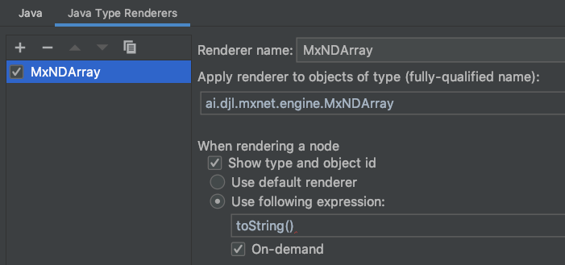

# Development Guideline

## Introduction

Thanks for your interest in working on Deep Java Library (DJL).
In this document, we will cover everything you need to build, test and debug your code when developing DJL.
We will cover everything you need to build, test and debug your code.

## Build
This project has enabled gradle wrapper, so you don't have to install gradle in your machine.
You can use the gradle wrapper using the following command:
```
./gradlew
```
There are several build targets in gradle you can use. The following are the most common targets:

- `formatJava` or `fJ`: clean up and format your Java code
- `build`: build the whole project and run all tests
- `javadoc`: build the javadoc only on the generated classes
- `jar`: build the project only

You can also go to the individual subfolder to build for that particular module.

Run following command to list all available tasks:
```sh
./gradlew tasks --all
```

## Test
Sometimes you may need to run individual tests or examples.
If you are developing with an IDE, you can run a test by selecting the test and clicking the "Run" button.

From the command line, you can run the following to run a test:
```
./gradlew :<module>:run -Dmain=<class_name> --args ""
```
For example, if you would like to run the integration test, you can use the following command:
```
./gradlew :integration:run -Dmain=ai.djl.integration.IntegrationTest
```

## Logging
To get a better understanding of your problems when developing, you can enable logging by adding the following parameter to your test command:
```
-Dai.djl.logging.level=debug
```
the value to set log level can be found [here](https://logging.apache.org/log4j/2.x/manual/customloglevels.html).

## Debug
When debugging a DJL application in IntelliJ, you must inspect your NDArray variables. Because NDArrays may contain
a large number of elements, rendering them may be resource-heavy and cause the debugger to hang.

IntelliJ allows you to [customize data view in Debug Tools](https://www.jetbrains.com/help/idea/customize-data-views.html).
You can create your own NDArray renderer as follows:


Please make sure:
- Check the "On-demand" option, which causes IntelliJ to only render the NDArray when you click on the variable.
- Change the "Use following expression" field to something like [toDebugString(100, 10, 10, 20)](https://djl-ai.s3.amazonaws.com/java-api/0.2.0/mxnet-engine/ai/djl/mxnet/engine/MxNDArray.html#toDebugString-int-int-int-int-)
if you want to adjust the range of NDArray's debug output.

## Common Problems

Please follow the [Troubleshooting](troubleshooting.md) document for common problems and their solutions.
