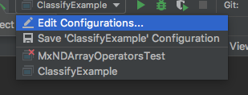

Basic Image Classify Example
==============

In this tutorial, you'll walk through the Classify model trained by MXNet.
You can provide an image and do image classification with different models.


## Setup Guide

### Prepare test image files

Two test images can be found in project test resource folder: src/test/resources.
You can also download an image of a cat from internet.

You can run the example using either Intellij or via command line.
### IntelliJ

1. Open `ClassifyExample.java`
2. Click `Edit Configuration` on the upper right side.

    

3. In `Program arguments`, input the following arguments `-n squeezenet_v1.1 -i ./example/src/test/resources/kitten.jpg`

    

4. Run `ClassifyExample.main()`

    

```text
[INFO] Inference result: class: "tabby, tabby cat", probability: 0.7371954321861267
[INFO] inference P50: 48.655 ms, P90: 48.655 ms
```

### Command line

```
cd example
./gradlew -Dmain=software.amazon.ai.example.ClassifyExample run --args="-n squeezenet_v1.1 -i ./src/test/resources/kitten.jpg"
```
```text
[INFO] Inference result: class: "tabby, tabby cat", probability: 0.7371954321861267
[INFO] inference P50: 66.185 ms, P90: 66.185 ms
```
---
The available arguments are as follows:

| Argument   | Comments                                 |
| ---------- | ---------------------------------------- |
| `-c`       | Number of iterations in each test. |
| `-d`       | Duration of the test. |
| `-i`       | Image file. |
| `-l`       | Directory for output logs. |
| `-n`       | Model name. |
| `-p`       | Path to the model directory, optional if model comes from model zoo. |
| `-u`       | URL to download model archive, optional point to a custom .mar file url. |

The available models are as follows:

| Models            |
| ----------------  |
| caffenet          |
| nin               |
| Inception-BN      |
| inception_v1      |
| resnet-18         |
| squeezenet_v1.1   |
| squeezenet_v1.2   |
| vgg16             |
| vgg19             |

You can also download the model from MXNet model zoo: <https://github.com/awslabs/mxnet-model-server/blob/master/docs/model_zoo.md> and unzip it.  
For example

```
cd build
curl -O https://s3.amazonaws.com/model-server/model_archive_1.0/squeezenet_v1.1.mar
unzip squeezenet_v1.1.mar
```