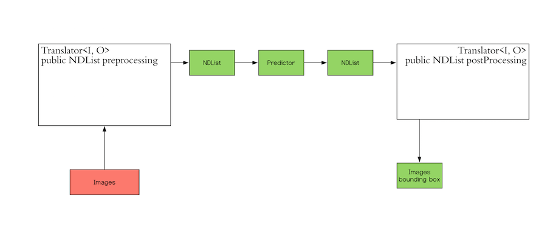
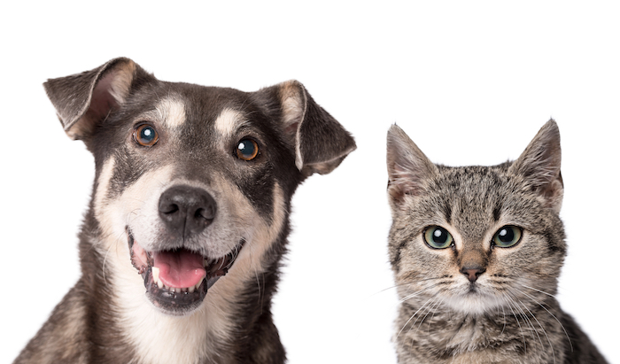
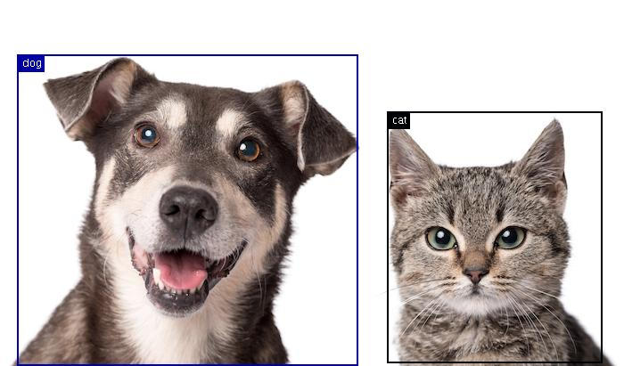

# Build your first Inference Application

## Introduction
Welcome to the Joule world.
Joule is an API designed to deal with all kinds of Deep Learning tasks.
You are able to create, train and do inference with Deep Learning models.

In this tutorial, you create your first application to use Joule for Deep Learning Inference.
You implement an [Object Detection application](https://en.wikipedia.org/wiki/Object_detection) based on pre-trained 
ResNet-50 SSD model.

## Prerequisite
Before you start, please see the JavaDoc for the following classes.
These are the core components we are using to load the pre-trained model and do inference.

- [Model](https://joule.s3.amazonaws.com/java-api/software/amazon/ai/Model.html)
- [Predictor](https://joule.s3.amazonaws.com/java-api/software/amazon/ai/inference/Predictor.html)
- [Translator](https://joule.s3.amazonaws.com/java-api/software/amazon/ai/Translator.html)
- [NDArray](https://joule.s3.amazonaws.com/java-api/software/amazon/ai/ndarray/NDArray.html) and 
[NDList](https://joule.s3.amazonaws.com/java-api/software/amazon/ai/ndarray/NDList.html)

## WorkFlow
The workflow looks like the following:



Inference in Deep Learning is the process of predicting the output for a given input based on a pre-defined model. 
Joule abstracts the whole process away from you. It can load the model, perform inference on the input, and provide 
output. Joule also allows you to provide user-defined inputs. 

The red block ("Images") in the workflow is the input that Joule expects from you. The green block ("Images 
bounding box") is the output that you expect. Since Joule does not know what input to expect and what format of output that you prefer, Joule provides the `Translator` interface so you can define your own 
input and output.  

The `Translator` interface encompasses the two white blocks: Pre-processing and Post-processing. The pre-processing 
component converts the user-defined input objects into an NDList, so that the `Predictor` in Joule can understand the 
input and make its prediction. Similarly, the post-processing block receives an NDList as the output from the 
`Predictor`. The post-processing block allows you to convert the output from the `Predictor` to the desired output 
format. 

In this tutorial, we are going to provide a step-by-step guide on using the Joule inference module to run inference on 
an image, based on the MxNet ResNet-50 SSD model for object detection. The code for the example can be found in 
    SsdExample.java in the example module. The goal is to be able to run inference on the following image, and verify that 
Joule is able to detect the cat in this image of a cute dog and cat couple. 





### Step 0 Include Dependencies

To include Joule in your project, add the following dependencies to your `build.gradle` file, or corresponding entry in
`pom.xml`.

~~~
compile "software.amazon.ai:joule-api:0.1.0"
runtime "org.apache.mxnet:joule:0.1.0"
runtime "org.apache.mxnet:mxnet-native-mkl:1.5.0-SNAPSHOT:osx-x86_64"
~~~

These packages can be found by adding the following maven repository to your `build.gradle` file, or corresponding entry in
                                                                     `pom.xml`:
~~~
maven {
   url 'https://joule.s3.amazonaws.com/repo'
}
~~~

ResNet-50 is a convolutional neural network that is trained on images from the 
[ImageNet database](http://www.image-net.org). The network has 50 layers and can detect objects in images, and classify 
the objects into different object categories. This tutorial uses MxNet ResNet-50 SSD. This model that has already been 
trained on MxNet to extract features from the input and perform its function. This saves time and effort for you. Deep Learning frameworks like MxNet, PyTorch, and TensorFlow all offer pre-trained models of many networks. 
Each of the frameworks would have their own formats, and files. 

Before you can perform inference, you need to download the MxNet ResNet-50 SSD model. To download the MxNet ResNet-50
SSD MxNet pre-trained model, run the following commands. Note the directory in which the models are downloaded 
into. You will need to provide the path to the directory while loading the model.
 
 ~~~
 curl -O https://s3.amazonaws.com/model-server/model_archive_1.0/examples/ssd/resnet50_ssd_model-symbol.json
 curl -O https://s3.amazonaws.com/model-server/model_archive_1.0/examples/ssd/resnet50_ssd_model-0000.params
 curl -O https://s3.amazonaws.com/model-server/model_archive_1.0/examples/ssd/synset.txt
 ~~~
 
 The symbol and params files above together represent the trained neural network. The `synset.txt` file is the mapping 
 between the numerical output and the category. 

### Step 1 Implement the Translator

Start by implementing the `Translator` interface explained previously. The `Translator` is the unit that 
converts user-defined input and output objects to NDList and vice versa. To this end, the Translator 
interface has two methods that need to be implemented: `processInput()` for pre-processing and `processOutput()` for 
post-processing. This is represented as the two white boxes in the image. These are the two main blocks of code that 
you need to implement. The rest of the blocks can be used as is to run inference. 

##### Pre-processing

The input to the inference API can be any user-defined object. The `processInput()` method in your
implementation of `Translator` must convert the user-defined input object into an `NDList`. 

For object detection, the `processInput()` method should convert an image into NDList. An image is usually represented
as a 3-Dimensional array of pixels. The height and width of the image form 2 dimensions. The third dimension in images
is called [Channels](https://en.wikipedia.org/wiki/Channel_(digital_image). For an RGB image, the channel size is 3, one
channel each for Red, Green, and Blue layers. These three dimensions together define one image. 

Occasionally, deep learning practitioners supply inputs in batches. 
[Batch learning](https://medium.com/@divakar_239/stochastic-vs-batch-gradient-descent-8820568eada1) helps in taking 
advantage of vectorization, which increases the speed of processing, and provides more stable convergence during 
training. 

The SSD Example will take an image in NCHW format:
- N: Batch size
- C: Channel 
- H: Height
- W: Width

The input of the translator should be an buffered image or any other type that can load an image. For the sake of 
simplicity, we are using Batch size of 1. Channel is usually 3(RGB). For Height and Width, we recommend to use 
(512, 512) since the model was trained on similar images. We can also resize the image during preprocessing to fit the 
required dimensions.

##### Post-processing

The output of the inference API can also be any user-defined object. The `processOutput()` method in the user
implementation of `Translator` must convert `NDList` to the required object. 

The shape of the output is [1, 6132, 6]. The batch size is 1, as it corresponds to the input. The output also allows for
6132 bounding boxes, one for each object detected. In most cases, most of the bounding boxes will be empty, except a few
for each of the objects  detected in the given input image. Each bounding box has 6 values - [Class, Probability, x, y, 
width, height]. The class value corresponds to the index of the corresponding category in the synset file. You can use 
this information to create any output object. 

The SsdExample will return a list of `DetectedObject` as its output. Joule API has a submodule called `cv` which 
offers utility classes and methods, that can be used to load images, and draw bounding boxes among other things. The 
SsdExample also showcases the use of these utilities. 

### Step 2 Load the model

Loading a model requires the path to the directory where the model is stored, and the name of the model. The variable 
`modelDir` is the path to the directory where the model was downloaded. The `modelName` can generally inferred from the 
name of the symbol or param files that were downloaded. In this case, it is `resnet50_ssd_model`. As we will see later, 
we will pass these values through command-line arguments.  
~~~
Model model = Model.load(modelDir, modelName);
~~~

### Step 3 Create Predictor

Once the model is loaded, we have everything we need to create a Predictor that can run inference. We have 
implemented a Translator, and loaded a model. We can create a Predictor using these objects. 

~~~
Predictor<BufferedImage, List<DetectedObject>> ssd = model.newPredictor(translator, context)
~~~

The Predictor class extends AutoCloseable. Therefore, it is good to use it within a try-with-resources block. 

### Run Inference

You can use the Predictor create above to run inference in one single step!
~~~
List<DetectedObject> predictResult = predictor.predict(img);
~~~

### SSD Sample Implementation
All instructions above to build inference can be seen in the [Sample SSD implementation](../src/main/java/software/amazon/ai/examples/SsdExample.java). The followings is the build command to try it out.
The sample SSD code provided in this module applies the bounding boxes to a copy of the original image, stores the result
a file called ssd.jpg in the provided output directory. 

The model, input image, output directory can all be provided as input. The available arguments are as follows:
 
 | Argument   | Comments                                 |
 | ---------- | ---------------------------------------- |
 | `-c`       | Number of iterations in each test. |
 | `-d`       | Duration of the test. |
 | `-i`       | Image file. |
 | `-l`       | Directory for output logs. |
 | `-n`       | Model name. |
 | `-p`       | Path to the model directory. |
 | `-u`       | URL to download model archive. |
 
 
You can navigate to the source folder, and simply type the following command to run the inference:
 
 ```
 ./gradlew -Dmain=software.amazon.ai.examples.inference.SsdExample run --args="-p build/ -n resnet50_ssd_model -i {PATH_TO_IMAGE} -l {OUTPUT_DIR}" 
 ```
 
 When you run inference on the image of the dog and the cat, this is the output generated. 
 


Voila! The model correctly detected the dog and the cat in the image, and has drawn a bounding box around them. 

