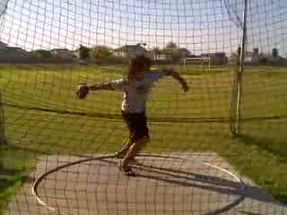

# Action recognition example

Action recognition is a computer vision technique to infer human actions (present state) in images or videos.

In this example, you learn how to implement inference code with a [ModelZoo model](../../docs/model-zoo.md) to detect dogs in an image.

The source code can be found at [ActionRecognition.java](https://github.com/awslabs/djl/blob/master/examples/src/main/java/ai/djl/examples/inference/ActionRecognition.java).

## Setup Guide

Follow [setup](../../docs/development/setup.md) to configure your development environment.

## Run action recognition example

### Input image file
You can find the image used in this example in the project test resource folder: `src/test/resources/action_discus_throw.png`



### Build the project and run
Use the following command to run the project:
```
cd examples
./gradlew run -Dmain=ai.djl.examples.inference.ActionRecognition
```

Your output should look like the following:
```text
[INFO ] - [
        class: "ThrowDiscus", probability: 0.99868
        class: "Hammering", probability: 0.00131
        class: "JavelinThrow", probability: 7.4e-09
        class: "VolleyballSpiking", probability: 1.8e-10
        class: "LongJump", probability: 5.8e-11
]
```

The results show that there is a 99.868 percent probability that the action is "ThrowDiscus".
